# Sporting Risk — betting intelligence

Two components of a betting-risk stack: **Betflow**, an operational analytics
cockpit that turns raw betslip data into a trading desk's view of its book, and
**Reconciliation**, a service that fuses match data from disagreeing providers
into one trustworthy canonical model.

They are independent — different problems, different stacks — but both answer the
same question a risk desk lives by: *can I trust this number, and where did it
come from?*

---

## Betflow — betting-flow analytics

**Live: https://yureesantos.github.io/srisk/**

An analysis of how betting flow develops across football fixtures, markets,
teams, players, selections, bet types and timing phases — turnover and GGR,
timing relative to kick-off, market and customer concentration, price value and
movement, anomaly detection, and statistically-flagged sharp customers.

It is delivered as two layers with a hard seam between them:

- **The pipeline** (`betflow/src`) — a deterministic Python pipeline that reads
  the raw exports, does every calculation once, validates eight families of
  invariants, and emits a single hashed artifact. It is the source of truth.
- **The cockpit** (`betflow/dashboard`) — a dense, always-on monitoring surface
  (React + Vite + TypeScript + ECharts) that renders that artifact and **computes
  nothing of its own**. Active alerts sit on top; every figure can be traced to
  the exact rows behind it via a built-in verify path.

Why the split matters: if a number on screen looks wrong, it is a pipeline
question, not a UI one — the dashboard only ever shows what the pipeline
validated, and the footer carries the dataset fingerprint + payload hash to prove
which run produced it.

```bash
# regenerate the artifact from the raw exports
cd betflow && python -m src.pipeline

# run the cockpit locally
cd betflow/dashboard && npm install && npm run dev     # http://localhost:5173
npm run build                                          # static build → dist/
```

The cockpit deploys to GitHub Pages automatically on every push that touches it
(`.github/workflows/deploy-dashboard.yml`); the site is fully static, with the
artifact baked in at build time, so there is no backend to run.

See [`betflow/dashboard/README.md`](betflow/dashboard/README.md) for how the two
layers fit together, and [`PRODUCT.md`](PRODUCT.md) / [`DESIGN.md`](DESIGN.md) for
the product and design decisions.

### What it surfaces

- **Key findings** — a trader-friendly briefing (what happened, why it matters,
  what to investigate), each linked to its evidence.
- **Flow by dimension** — turnover and volume by market, competition, fixture,
  selection, team, region and bet type, with the aggregation grain always stated.
- **Timing** — flow relative to kick-off (pre-match, post-line-ups proxy,
  in-play upper bound).
- **Price value & movement** — taken prices vs a later reference price; steamers
  and drifters.
- **Concentration** — Lorenz curves and Gini for customers and fixtures.
- **Anomaly detectors** — turnover spikes, abnormal exposure, sharp price moves,
  repeated backing, same-second clusters — each with its rule and confidence.
- **Sharp behaviour** — customers beating the reference price by more than
  chance, flagged by a significance test with false-discovery-rate control, not
  a leaderboard.
- **Data quality** — the known imperfections and the decisions taken around them.

---

## Streaming — the same analysis under continuous ingestion

Betflow computes everything once over a frozen export. This is the design for
running the same analysis when the data never stops arriving: 70k–500k betslips
per minute, a target of 20M+ rows, and no downtime while it happens.

**Built and measured.** Run it with `streaming/load/end_to_end.sh` — the
expected figures are in [Running it](#running-the-streaming-pipeline) below, and
the raw results are committed under `streaming/results/`.

| Document | What it settles |
|---|---|
| [DESIGN-STREAMING.md](docs/DESIGN-STREAMING.md) | Topology, the contract at every seam, measurement plan, build order |
| [ADR-0007](docs/adr/0007-betslip-facts-are-mutable.md) | Betslip facts are mutable, so ingestion resolves by identity + version |
| [ADR-0008](docs/adr/0008-clickhouse-as-the-analytical-store.md) | ClickHouse as the analytical store, and why not Postgres or Mongo |
| [ADR-0009](docs/adr/0009-freshness-is-declared-per-layer.md) | Freshness declared per layer; the artifact hash becomes hash + watermark |
| [ADR-0010](docs/adr/0010-scaling-path-and-the-state-that-blocks-it.md) | What breaks first, and the state that blocks replication |
| [ADR-0011](docs/adr/0011-http-cache-in-front-of-the-artifact-api.md) | HTTP cache in front of the API, invalidated by event |
| [ADR-0012](docs/adr/0012-final-not-argmax-measured.md) | Collapse with `FINAL`, not `argMax` — and measure before recommending |
| [ADR-0013](docs/adr/0013-a-log-between-producer-and-consumer.md) | A log between producer and consumer, for observability rather than throughput |
| [ADR-0014](docs/adr/0014-aggregate-in-the-database.md) | Aggregate in the database; canonicalise at ingest |
| [Ingestion flow](docs/diagrams/ingestion-flow.md) · [Scaling](docs/diagrams/scaling.md) | Diagrams (render on GitHub) |

### The path a betslip takes

```mermaid
flowchart LR
    P["Producer<br/><b>515,418/min</b><br/>shape calibrated<br/>against the export"]
    K["Kafka<br/>6 partitions<br/>by hash(uid)"]
    C["Consumer<br/>canonicalise · hash<br/>batch insert"]
    D[("ClickHouse<br/>ReplacingMergeTree<br/><b>562 ms</b> to land")]
    R["Refresh<br/>SQL aggregation<br/><b>0.59 s</b> class 1"]
    A["Artifact<br/>+ watermark<br/>+ hash"]
    V["Varnish<br/><b>99.8%</b> hit<br/>85 backend fetches"]
    U["Dashboard<br/><b>1.74 ms</b><br/>polls every 5 s"]

    P -->|"idempotent<br/>out of order"| K
    K -->|"lag from<br/>the broker"| C
    C -->|"append only<br/>never update"| D
    D -->|"FINAL<br/>collapse"| R
    R --> A --> V --> U

    classDef fast fill:#0f3d2e,stroke:#2e9e6b,color:#e6f5ee
    classDef store fill:#123a52,stroke:#3d8fc4,color:#e6f2fa
    classDef neutral fill:#1e2a38,stroke:#5a7ea8,color:#e8f0f8
    class P,K,C neutral
    class D,R store
    class A,V,U fast
```



**Emitted to on-screen: 5.0 s median** (4.1–6.3 s), measured end to end under
sustained 500k/min. Of that, **0.56 s is transport and 4.44 s is waiting for the
next refresh tick** — the cadence is 89% of the total, and it is a choice rather
than a limit. ADR-0009 set it in seconds because settlements were measured
reversing inside 95 seconds, so a GGR figure fresher than that reports noise as
signal.

Three numbers get confused with each other, and only the first is a wait:

| | Measured | What it is |
|---|---|---|
| response latency | **1.74 ms** | what a reader waits for the page |
| data age | **2.8 – 5.9 s** | how stale the figure on screen is |
| recompute cost | 0.59 s (class 1) | background, and what volume actually moves |

Volume moves the third, which moves the second, and leaves the first alone —
because the dashboard reads a precomputed artifact rather than querying the
database. That is the same seam Betflow already had; streaming changes what
writes the artifact, not who reads it.

### Running the streaming pipeline

```bash
cd streaming && docker compose up -d          # ClickHouse, Kafka, AKHQ, API, Varnish
curl -s http://localhost:18123/ping           # -> Ok.
```

Requires `confluent-kafka` (`pip install confluent-kafka`) and, for the reader
load, `k6` (`brew install k6`).

**The whole pipeline at once** — producer → Kafka → consumer → ClickHouse →
refresh → API → Varnish → 100 concurrent readers:

```bash
streaming/load/end_to_end.sh 500000 60        # rate per minute, seconds
```

Measured on an M3 Pro with Docker allocated 4 CPUs / 8.3 GB (full output in
[`streaming/results/07-end-to-end.md`](streaming/results/07-end-to-end.md)):

```
producer → Kafka        8,590 ev/s  (515,418/min — the brief's ceiling)
consumer → ClickHouse   2,015,499 rows in 86s
refresh (SQL, class 1)  9 ticks, mean 3.98s
read latency p50/p95    1.74 ms / 15.87 ms
cache hit rate          99.84%
backend fetches         85 for 5,201 client requests
                        THRESHOLDS PASSED
```

**The three numbers that get confused with each other**, and only the first is
what a user waits for:

| | Measured | What it is |
|---|---|---|
| response latency | **1.74 ms** | what a reader waits |
| **data age** | **2.8 – 5.9 s** | how stale the figure on screen is |
| recompute cost | 0.16 – 8.25 s | what runs in the background |

Volume moves the third, which moves the second, and leaves the first alone —
because the front end reads a precomputed artifact rather than querying the
database. At 70k/min the same figures hold with more headroom; the ceiling was
measured at 500k/min because that is what the brief asks for.

**Running the pieces separately**

```bash
# generate betslips at a dialled rate, shape calibrated against the real export
python -m streaming.producer --rate 500000 --duration 60 --sink kafka

# consume, canonicalise, insert (idempotent — replay changes nothing)
python -m streaming.consumer --source kafka --database srisk

# recompute and publish an artifact; class 1 aggregates in SQL
python -m streaming.refresh --once --classes 1 --out streaming/out/artifacts

# 100 concurrent readers against Varnish
k6 run streaming/load/k6_readers.js
```

**Verifying the properties the design claims**

```bash
streaming/load/kafka_lag.sh          # lag rises and drains, read from the broker
streaming/load/kafka_rescale.sh      # scale consumers live; partitions rebalance
streaming/load/kafka_restart.sh      # SIGKILL mid-stream; state converges identically
streaming/load/concurrent_test.sh    # read latency holds under sustained ingest
```

Each writes its numbers to `streaming/results/`. The producer's calibration is
itself checked — `python -m streaming.producer.check_shape` asserts the
generated stream reproduces the export's Gini, cardinalities and currency mix,
because uniformly random values would make every concentration metric
meaningless.

**What the dashboard shows.** The artifacts are served at
`http://localhost:18081/artifact/<name>` with per-class `Cache-Control`, and
`http://localhost:18081/artifact/ops` reports each artifact's age, the stream
watermark and the refresh timing. The dashboard itself still reads the payload
baked in at build time; polling the API is the remaining gap in the brief's
"updates the ui in near realtime".

The design rests on a measured fact rather than an assumption. The two exports in
`data/raw/` were generated **95 seconds apart**; across the 42 shared rows whose
identity is unambiguous, `TURNOVER` differs on **0** while `GGR` differs on
**14** — settlements being reversed inside that window. Turnover is immutable and
safely incremental; GGR is retroactively mutable and cannot be summed
incrementally without correction. That split decides the write path, the
database, the cache policy, and which metrics can be realtime at all.

---

## Reconciliation — canonical model from two feeds

Two providers describe the same match with completely different schemas —
different id types, name formats, odds representations, stat keys, and even a
disagreement on the final score. This service maps their entities into one
canonical model, **carrying both source ids and a confidence on every mapping**,
resolves conflicts on the evidence, and **flags what it cannot map for human
review rather than guessing**.

```bash
cd reconciliation
python -m src                          # feeds/*.json → out/canonical.json + out/review.json
pip install pytest && python -m pytest # 38 tests
```

The decisions are the substance: the score conflict is resolved on evidence (each
feed's own per-player goal tally corroborates one score and contradicts the
other), kickoff is compared as an instant rather than a string, odds are kept as
per-source quotes rather than collapsed, and nothing below the match threshold is
ever force-matched.

See [`reconciliation/README.md`](reconciliation/README.md) for the model and the
run details, and [`reconciliation/SUBMISSION.md`](reconciliation/SUBMISSION.md)
for the decisions and their rationale.

---

## How this was built

Both components were built with AI assistance (Claude Code), and
[`docs/AI-PROCESS.md`](docs/AI-PROCESS.md) is the record of that process — the
method, the tooling, and the actual prompts that shaped the work, including the
ones that rejected earlier attempts.

---

## Repository

```
betflow/            betting-flow analytics
  src/              the Python analysis pipeline
  dashboard/        the React monitoring cockpit
  outputs/          generated analysis artifacts
reconciliation/     two-feed canonical reconciliation (Python)
docs/
  DATA-FINDINGS.md      measured facts about the source data
  DESIGN-STREAMING.md   the continuous-ingestion design
  AI-PROCESS.md         how this was built, and the prompts behind it
  adr/                  architecture decision records
  diagrams/             data flow and scaling topology (Mermaid)
PRODUCT.md          who the cockpit is for and what it must do
DESIGN.md           the visual system and its constraints
CONTEXT.md          the domain glossary (ubiquitous language)
```
