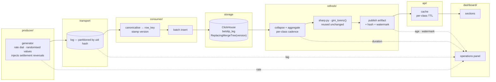

# Streaming design

What gets built, what each part is responsible for, and what passes between
them. The **why** lives in the ADRs (0007–0010); this document is the **what**,
so that implementation is execution rather than invention.

Reading order: ADR-0007 (facts are mutable) → ADR-0008 (ClickHouse) → ADR-0009
(freshness per layer) → ADR-0010 (scaling) → this.

---

## The system in one paragraph

A **producer** emits betslip legs at a dial-controlled rate (70k–500k/min) into a
partitioned **log**. A **consumer** canonicalises each leg into the ADR-0007
identity, stamps a version, and batch-inserts into **ClickHouse** — append only,
never update. A **refresh job** sweeps the table on a per-class cadence, collapses
versions at read time, computes the same metrics the batch pipeline computes, and
publishes an **artifact** per layer with a hash and a watermark. An **API** serves
those artifacts from cache; the **dashboard** renders them and computes nothing.
An **operations panel** in the dashboard shows ingest rate, consumer lag, refresh
duration and per-layer age, which is what makes the scaling demo visible.

---

## Components



### Responsibilities

| Component | Owns | Explicitly does not |
|---|---|---|
| `producer/` | Rate control, value randomisation, settlement-reversal injection, emission timestamp (= version) | Know about identity keys or storage |
| `consumer/` | Canonicalisation, `row_key` hashing, version stamping, batched insert, lag reporting | Aggregate, deduplicate, or interpret |
| `refresh/` | Read-time collapse, aggregation, statistics, artifact publication, watermark | Accept per-reader parameters |
| `api/` | Serve artifacts, per-class cache policy, invalidation | Compute anything |
| `dashboard/` | Render artifacts, client-side currency selection, operations panel | Compute anything (unchanged from batch) |

The `refresh/` boundary is where the existing `betflow/src` code is **reused, not
rewritten**: `sharp.analyse()` and `gini_lorenz()` take frames and return tables,
so they take frames from ClickHouse exactly as they took frames from pandas.

---

## Contracts

### producer → log

One message per leg. Fields mirror the export's 17 columns plus:

| Field | Type | Meaning |
|---|---|---|
| `emitted_at` | epoch ms | Becomes `version` (ADR-0007). Producer's clock. |
| `event_kind` | enum | `placement` \| `settlement` \| `reversal` |

`placement` carries turnover and null GGR. `settlement` and `reversal` carry the
same identity fields with a new GGR and a higher `emitted_at` — this is how the
measured 95-second reversal behaviour is reproduced (ADR-0007).

Partition key: `hash(uid)`. Chosen so all activity for one Uid lands in one
partition, which keeps per-Uid ordering meaningful without a global order.

### How the producer randomises

"Randomized values" is a requirement with a trap in it: values drawn from uniform
distributions produce metrics that are structurally meaningless. Uniform stakes
give a Gini near 0, uniform market choice erases the concentration the dashboard
exists to show, and no anomaly detector fires because there are no anomalies to
find. The generator must reproduce the *shape* of the measured data, not just its
column types.

Distributions are taken from the real export rather than invented:

| Field | Distribution | Anchored on |
|---|---|---|
| Stake | Log-normal, per currency | Measured Gini 0.819 (EUR) and 0.914 (PEN) on turnover per Uid |
| Uid | Zipf over a growing pool | Measured 10,405 Uids; betslip-count Gini 0.644 |
| Market | Empirical frequencies | 119 markets, measured shares |
| Competition / fixture | Empirical, weighted by fixture volume | 56 competitions, 453 fixtures |
| Currency | EUR 88% / PEN 12% / USD <1% | Measured betslip counts |
| Bet type | SIMPLE / COMBINED at measured ratio | Measured leg-to-betslip inflation 1.087x (EUR) |
| Price | Log-normal, market-dependent | Measured price ranges per market |
| Legs per betslip | 1 for SIMPLE; measured distribution for COMBINED | Betslip identity, ADR-0003 |

Two behaviours are injected deliberately because they exercise decisions:

- **Settlement reversals.** A configurable share of settled betslips emit a later
  `reversal` with a higher `emitted_at`, reproducing what was measured across the
  two exports (14 of 42 unambiguous shared rows, inside 95 seconds). Without
  these the merge path is never exercised and ADR-0007 is untested.
- **Duplicate delivery.** A configurable share of events are emitted twice,
  reproducing the 36,832 and 17,253 exact duplicates already present in the
  exports. This is what proves idempotency rather than assuming it.

The rate dial is independent of all of the above: it controls emission rate only,
so a rate change never changes the shape of the data being generated. That
separation is what makes a rate change interpretable — if a metric moves when the
rate moves, it is the system responding, not the data changing underneath.

### log → consumer

At-least-once. The consumer must assume redelivery and out-of-order arrival.
Correctness does not depend on either (ADR-0007).

### consumer → ClickHouse

Batched `INSERT`, never `UPDATE`. Every row carries `row_key` (hash of the
ADR-0007 identity) and `version` (= `emitted_at`). Batch size and flush interval
are the consumer's two tuning knobs and are reported to the operations panel.

### ClickHouse → refresh

Every read collapses with `argMax(col, version) GROUP BY row_key` (ADR-0008).
A query that omits the collapse is a correctness bug, not a performance one —
this is the single most important invariant in the system and is covered by test.

### refresh → api

One artifact per class, each carrying the envelope the batch product already
uses, plus streaming fields:

```json
{
  "artifact": "flow",
  "layer": "placement_complete",
  "schema_version": "...",
  "generated_at": "...",
  "watermark": 1755012345678,
  "window": null,
  "payload_hash": "sha256:...",
  "source_lineage": { "partitions": 8, "offsets": [...] },
  "data": { }
}
```

`window` is null for Class 1 and 2, and `{from, to}` for Class 3.

### api → dashboard

Unchanged in shape from the batch product: the dashboard fetches artifacts and
renders them. Personalisation stays client-side (ADR-0009), so every request is
identical at the cache.

---

## Refresh cadence and cache policy

Per ADR-0009. The cadence is derived from the data, not from what is achievable.

| Class | Metrics | Refresh | Cache |
|---|---|---|---|
| 1 — placement-complete | turnover, counts, dimensional breakdowns, timing | 1–5 s | short TTL + stale-while-revalidate |
| 2 — settlement-complete | GGR, net revenue, margin | 30–60 s | longer TTL |
| 3 — windowed | Gini/Lorenz, anomaly detectors | on window close | until window closes; event-invalidated |
| 3 — windowed, kick-off bound | price value, sharp test + FDR | on kick-off + window close | until window closes |

---

## Measurement

Measurement is a deliverable, not instrumentation — it is what answers "scale
horizontally and vertically". It is emitted by the components that own the
numbers and rendered in the dashboard's **operations panel**.

### What is measured

| Metric | Emitted by | Why it matters |
|---|---|---|
| Ingest rate (events/s) | producer | The dial; the independent variable |
| Consumer lag (events, seconds) | consumer | Separates "keeping up" from "falling behind" (ADR-0010) |
| Insert batch size / flush interval | consumer | The knobs, so a change is attributable |
| Refresh duration per class (p50/p99) | refresh | Predicted second bottleneck |
| Artifact age per class | refresh | What ADR-0009 promises the reader |
| Watermark | refresh | Position in the stream the artifact saw |
| Rows in table / after collapse | refresh | Shows the collapse working |

### How it is shown

**In the dashboard** — an operations panel carrying the live figures. It belongs
in the footer region, which is already the home of the guarantee
(`dataset_fingerprint`, `payload_hash`), extended per ADR-0009 to carry per-layer
age and watermark.

The demo reads directly off this panel: baseline at 70k/min with lag flat →
raise to 500k/min → lag climbs and refresh p99 rises → point at the saturated
component → add consumers → lag drains on screen.

**Persisted** — each load run also writes a JSON record (rate, duration, lag
series, refresh percentiles, resulting artifact hashes) so results are
reproducible and quotable without re-running the demo. The dashboard is the
demonstration; the JSON is the evidence.

### The resource budget, measured

Measured on the target machine (M3 Pro, 11 cores, 19.3 GB), which is what the
demo runs on. **Docker is allocated 4 CPUs and 8.3 GB**, and that allocation — not
the host — is the real constraint, because ClickHouse, producer, consumer, API,
Varnish and the load generator all share it.

Per-event application cost, single core:

| Step | Measured | Headroom over 8,333 ev/s (500k/min) |
|---|---|---|
| Canonicalise + BLAKE2b hash | 902,000 ev/s | 108x |
| `json.dumps` | 267,000 ev/s | 32x |
| `json.loads` | 283,000 ev/s | 34x |
| Wire volume (451 bytes/event) | 3.8 MB/s | trivial |

The consequence is worth stating plainly: **the brief's ceiling of 500k/min is
comfortably reachable on this machine.** Per-event work is 32–108x faster than
required, so the demo does not need excuses. It also refutes ADR-0010's original
prediction that consumer CPU would saturate first — corrected there.

What is expected to bind instead: CPU contention between containers within the
4-CPU allocation, and the ClickHouse insert path. Recorded as expectation, not
prediction, since the first prediction was two orders of magnitude off.

### Target volume: 20M rows, not a reduced sample

The question this exercise answers, asked directly in the call, is *"what would
you do with 20M betslips?"* — prompted by the batch pipeline taking 54 seconds
over an Excel export of 113k legs.

That target is not a separate scenario requiring special provision: **the
requested rate produces it.** 500k/min sustained for 40 minutes is 20M rows. The
demo therefore runs to 20M rather than validating on a reduced sample, because a
demonstration at 100k rows leaves the original objection standing.

Storage is not a constraint. With dimensions stored as `LowCardinality` — 56
competitions, 119 markets, 453 fixtures, all measured — 20M rows are expected to
occupy well under 1 GB, against Docker's 8.3 GB allocation. The same rows as raw
JSON would be ~9 GB, and in Excel they would not exist at all: the format caps at
roughly 1M rows per sheet, so the current input format cannot represent the target
volume by two orders of magnitude.

**The contrast this produces** is the exercise's real answer:

| | Batch (Excel + pandas) | Streaming (ClickHouse) |
|---|---|---|
| Source | 12 MB xlsx | continuous stream |
| Volume | 113k legs | 20M+ |
| Reading input | 21 s (openpyxl, cell by cell) | not a step — already stored |
| Computing every metric | 8.4 s (41 s before optimisation) | target: sub-second |
| Updating | rerun everything | continuous tick |
| Downtime to update | the entire pipeline | none |

The batch figures are measured. **The ClickHouse column is a target, not a
measurement, until step 1 of the build order produces it** — and if it comes back
slower than expected, that number is reported as measured rather than as hoped.

The sharper form of the argument: 54 seconds does not scale to 20M, it explodes.
Both dominant costs were linear in row count with a large per-row constant —
Python-level `.apply()` over groups, and XML parsing per cell. The honest claim is
not "the old pipeline was slow", it is that **its input format cannot hold the
target volume, and its execution model degrades linearly with a constant that
makes 20M impractical.**

### The scaling demo

The point is not to show the system working at the requested rate — that is
table stakes and, per the budget above, unremarkable. The point is to **find the
ceiling on this machine, name the resource that produces it, and remove it
live.**

| Step | Rate | What the operations panel shows | What is said |
|---|---|---|---|
| 1. Baseline | 70k/min | Lag flat near zero; refresh well inside its tick | "This is the low end of the brief" |
| 2. Requested ceiling | 500k/min | Lag still flat; refresh duration up but inside cadence | "This is the top of what was asked for, with headroom" |
| 3. Past the brief | 1M/min, then higher | Lag begins to grow; refresh p99 climbs | "Now it is degrading — and here is precisely where" |
| 4. Diagnose | held | Panel identifies the saturated component | Point at the number, not at a guess |
| 5. Scale out | held | Add consumer replicas; lag drains on screen | "This works only because ingestion is idempotent — ADR-0007" |
| 6. Name the wall | — | — | "Vertical to here, horizontal from here, and this is the state that stops replication" (ADR-0010) |

Steps 3–5 are the exercise's actual question. Step 5 is only safe because
re-delivery is idempotent and order-independent; without ADR-0007 adding a
consumer mid-flight would corrupt data rather than fix throughput.

### Reader load

Separately from ingest, 100 steady concurrent readers are simulated against the
front end with **k6**: 100 virtual users, constant arrival, declared thresholds
as pass/fail criteria (p95 latency, zero errors, cache hit rate), and JSON
output kept as evidence.

The number that answers the brief is **backend request count**: with request
coalescing (ADR-0011), 100 concurrent readers should produce roughly one backend
fetch per TTL period rather than 100 per period. That ratio is the measurement,
and it is reported alongside hit rate and p95.

### The measurement that validates correctness

Separate from performance, and the one that matters most: **replaying the same
input twice must produce the same artifact hash.** This is the streaming
equivalent of the batch pipeline's invariant suite, and it is what makes the
ADR-0009 guarantee real rather than decorative.

A second correctness check compares the streaming artifact against the batch
pipeline's output over the same input. The batch pipeline is the oracle: same
input, same numbers, or one of them is wrong.

---

## Repository layout

```
streaming/
  producer/        rate dial, randomisation, reversal injection
  consumer/        canonicalisation, hashing, batched insert
  refresh/         collapse, aggregate, publish; imports betflow/src
  api/             artifact serving, cache
  schema/          ClickHouse DDL
  load/            load harness, JSON result records
  docker-compose.yml
betflow/
  src/             unchanged — the correctness oracle
  dashboard/       gains the operations panel
```

---

## Build order

Each step is a PR, and each is verifiable on its own.

1. **Schema + compose** — ClickHouse up, DDL applied, batch export loadable into
   it. Verifiable: row counts match the batch pipeline's. Then **synthesise 20M
   rows directly into the table** and time the seven breakdowns over them — this
   is the number the whole exercise turns on, and it is worth having before any
   producer or consumer exists, because a bad result here invalidates the design
   while it is still cheap to change.
2. **Producer** — rate dial and reversal injection. Verifiable: measured output
   rate matches the dial; reversals appear at the configured share.
3. **Consumer** — canonicalisation and insert. Verifiable: replaying the same
   input twice leaves the collapsed table identical.
4. **Refresh** — collapse, aggregate, publish. Verifiable: artifact matches the
   batch pipeline's over the same input.
5. **API + cache + operations panel** — Verifiable: 100 concurrent readers, cache
   hit rate measured, per-class TTL observed.
6. **Load harness** — the demo. Verifiable: it produces the JSON record and the
   panel moves.

If time runs short, the cut order is the one already set: the dashboard panel
goes first, then the cache, then the API. **Measurement never gets cut** — it is
what answers the question the exercise is actually asking.
