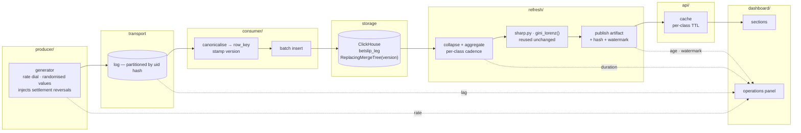

# Streaming design

What gets built, what each part is responsible for, and what passes between
them. The **why** lives in the ADRs (0007–0010); this document is the **what**,
so that implementation is execution rather than invention.

Reading order: ADR-0007 (facts are mutable) → ADR-0008 (ClickHouse) → ADR-0009
(freshness per layer) → ADR-0010 (scaling) → this.

---

## The system in one paragraph

A **producer** emits betslip legs at a dial-controlled rate (70k–500k/min) into a
partitioned **log**. A **consumer** canonicalises each leg into the ADR-0007
identity, stamps a version, and batch-inserts into **ClickHouse** — append only,
never update. A **refresh job** sweeps the table on a per-class cadence, collapses
versions at read time, computes the same metrics the batch pipeline computes, and
publishes an **artifact** per layer with a hash and a watermark. An **API** serves
those artifacts from cache; the **dashboard** renders them and computes nothing.
An **operations panel** in the dashboard shows ingest rate, consumer lag, refresh
duration and per-layer age, which is what makes the scaling demo visible.

---

## Components



### Responsibilities

| Component | Owns | Explicitly does not |
|---|---|---|
| `producer/` | Rate control, value randomisation, settlement-reversal injection, emission timestamp (= version) | Know about identity keys or storage |
| `consumer/` | Canonicalisation, `row_key` hashing, version stamping, batched insert, lag reporting | Aggregate, deduplicate, or interpret |
| `refresh/` | Read-time collapse, aggregation, statistics, artifact publication, watermark | Accept per-reader parameters |
| `api/` | Serve artifacts, per-class cache policy, invalidation | Compute anything |
| `dashboard/` | Render artifacts, client-side currency selection, operations panel | Compute anything (unchanged from batch) |

The `refresh/` boundary is where the existing `betflow/src` code is **reused, not
rewritten**: `sharp.analyse()` and `gini_lorenz()` take frames and return tables,
so they take frames from ClickHouse exactly as they took frames from pandas.

---

## Contracts

### producer → log

One message per leg. Fields mirror the export's 17 columns plus:

| Field | Type | Meaning |
|---|---|---|
| `emitted_at` | epoch ms | Becomes `version` (ADR-0007). Producer's clock. |
| `event_kind` | enum | `placement` \| `settlement` \| `reversal` |

`placement` carries turnover and null GGR. `settlement` and `reversal` carry the
same identity fields with a new GGR and a higher `emitted_at` — this is how the
measured 95-second reversal behaviour is reproduced (ADR-0007).

Partition key: `hash(uid)`. Chosen so all activity for one Uid lands in one
partition, which keeps per-Uid ordering meaningful without a global order.

### log → consumer

At-least-once. The consumer must assume redelivery and out-of-order arrival.
Correctness does not depend on either (ADR-0007).

### consumer → ClickHouse

Batched `INSERT`, never `UPDATE`. Every row carries `row_key` (hash of the
ADR-0007 identity) and `version` (= `emitted_at`). Batch size and flush interval
are the consumer's two tuning knobs and are reported to the operations panel.

### ClickHouse → refresh

Every read collapses with `argMax(col, version) GROUP BY row_key` (ADR-0008).
A query that omits the collapse is a correctness bug, not a performance one —
this is the single most important invariant in the system and is covered by test.

### refresh → api

One artifact per class, each carrying the envelope the batch product already
uses, plus streaming fields:

```json
{
  "artifact": "flow",
  "layer": "placement_complete",
  "schema_version": "...",
  "generated_at": "...",
  "watermark": 1755012345678,
  "window": null,
  "payload_hash": "sha256:...",
  "source_lineage": { "partitions": 8, "offsets": [...] },
  "data": { }
}
```

`window` is null for Class 1 and 2, and `{from, to}` for Class 3.

### api → dashboard

Unchanged in shape from the batch product: the dashboard fetches artifacts and
renders them. Personalisation stays client-side (ADR-0009), so every request is
identical at the cache.

---

## Refresh cadence and cache policy

Per ADR-0009. The cadence is derived from the data, not from what is achievable.

| Class | Metrics | Refresh | Cache |
|---|---|---|---|
| 1 — placement-complete | turnover, counts, dimensional breakdowns, timing | 1–5 s | short TTL + stale-while-revalidate |
| 2 — settlement-complete | GGR, net revenue, margin | 30–60 s | longer TTL |
| 3 — windowed | Gini/Lorenz, anomaly detectors | on window close | until window closes; event-invalidated |
| 3 — windowed, kick-off bound | price value, sharp test + FDR | on kick-off + window close | until window closes |

---

## Measurement

Measurement is a deliverable, not instrumentation — it is what answers "scale
horizontally and vertically". It is emitted by the components that own the
numbers and rendered in the dashboard's **operations panel**.

### What is measured

| Metric | Emitted by | Why it matters |
|---|---|---|
| Ingest rate (events/s) | producer | The dial; the independent variable |
| Consumer lag (events, seconds) | consumer | Separates "keeping up" from "falling behind" (ADR-0010) |
| Insert batch size / flush interval | consumer | The knobs, so a change is attributable |
| Refresh duration per class (p50/p99) | refresh | Predicted second bottleneck |
| Artifact age per class | refresh | What ADR-0009 promises the reader |
| Watermark | refresh | Position in the stream the artifact saw |
| Rows in table / after collapse | refresh | Shows the collapse working |

### How it is shown

**In the dashboard** — an operations panel carrying the live figures. It belongs
in the footer region, which is already the home of the guarantee
(`dataset_fingerprint`, `payload_hash`), extended per ADR-0009 to carry per-layer
age and watermark.

The demo reads directly off this panel: baseline at 70k/min with lag flat →
raise to 500k/min → lag climbs and refresh p99 rises → point at the saturated
component → add consumers → lag drains on screen.

**Persisted** — each load run also writes a JSON record (rate, duration, lag
series, refresh percentiles, resulting artifact hashes) so results are
reproducible and quotable without re-running the demo. The dashboard is the
demonstration; the JSON is the evidence.

### The measurement that validates correctness

Separate from performance, and the one that matters most: **replaying the same
input twice must produce the same artifact hash.** This is the streaming
equivalent of the batch pipeline's invariant suite, and it is what makes the
ADR-0009 guarantee real rather than decorative.

A second correctness check compares the streaming artifact against the batch
pipeline's output over the same input. The batch pipeline is the oracle: same
input, same numbers, or one of them is wrong.

---

## Repository layout

```
streaming/
  producer/        rate dial, randomisation, reversal injection
  consumer/        canonicalisation, hashing, batched insert
  refresh/         collapse, aggregate, publish; imports betflow/src
  api/             artifact serving, cache
  schema/          ClickHouse DDL
  load/            load harness, JSON result records
  docker-compose.yml
betflow/
  src/             unchanged — the correctness oracle
  dashboard/       gains the operations panel
```

---

## Build order

Each step is a PR, and each is verifiable on its own.

1. **Schema + compose** — ClickHouse up, DDL applied, batch export loadable into
   it. Verifiable: row counts match the batch pipeline's.
2. **Producer** — rate dial and reversal injection. Verifiable: measured output
   rate matches the dial; reversals appear at the configured share.
3. **Consumer** — canonicalisation and insert. Verifiable: replaying the same
   input twice leaves the collapsed table identical.
4. **Refresh** — collapse, aggregate, publish. Verifiable: artifact matches the
   batch pipeline's over the same input.
5. **API + cache + operations panel** — Verifiable: 100 concurrent readers, cache
   hit rate measured, per-class TTL observed.
6. **Load harness** — the demo. Verifiable: it produces the JSON record and the
   panel moves.

If time runs short, the cut order is the one already set: the dashboard panel
goes first, then the cache, then the API. **Measurement never gets cut** — it is
what answers the question the exercise is actually asking.
