# Ingestion flow

How a betslip leg travels from a partner feed to a rendered number, and what
guarantee it carries at each hop. Latencies are targets at the 500k/min
(8,333 events/s) design point; measured figures replace them once the load
harness runs.

The colour split is the subject of ADR-0007: immutable facts (turnover,
dimensions) can be folded incrementally, mutable facts (GGR, net revenue) cannot.

```mermaid
flowchart LR
    subgraph SRC["Partner feeds"]
        P1["Producer<br/>70k–500k betslips/min<br/>at-least-once, out of order"]
    end

    subgraph TRANSPORT["Transport"]
        LOG["Append-only log<br/>partitioned by Uid hash<br/>retains raw payload"]
    end

    subgraph CONSUME["Consumer"]
        MERGE["Merge on leg identity<br/>ADR-0003 key + Price<br/>last-writer-wins by snapshot time"]
        CLASS{"Fact class?"}
    end

    subgraph STORE["Storage"]
        FACTS[("Betslip facts<br/>current state<br/>one row per leg identity")]
        HIST[("Superseded values<br/>audit trail")]
        ROLL[("Incremental rollups<br/>turnover by dimension")]
        WIN[("Window snapshots<br/>Gini · sharp test · anomalies")]
    end

    subgraph SERVE["Serving"]
        API["Read API<br/>per-layer envelopes"]
        CACHE["Cache<br/>short TTL + stale-while-revalidate"]
        UI["Dashboard<br/>every number labelled<br/>with layer and latency"]
    end

    P1 -->|"~5 ms<br/>network"| LOG
    LOG -->|"consumer lag<br/>the number to watch"| MERGE
    MERGE --> CLASS
    CLASS -->|"immutable<br/>write once"| FACTS
    CLASS -->|"mutable<br/>overwrite + retain prior"| FACTS
    FACTS -.->|"prior value"| HIST
    FACTS -->|"~1 s<br/>associative fold"| ROLL
    FACTS -->|"on window close<br/>or fixture kick-off"| WIN
    ROLL -->|"speed layer"| API
    WIN -->|"batch layer"| API
    API --> CACHE
    CACHE -->|"100 concurrent readers"| UI

    classDef immutable fill:#0f3d2e,stroke:#2e9e6b,color:#e6f5ee
    classDef mutable fill:#4a2a12,stroke:#c97a2e,color:#fdf0e3
    classDef neutral fill:#1e2a38,stroke:#5a7ea8,color:#e8f0f8
    class ROLL immutable
    class WIN,HIST mutable
    class LOG,MERGE,FACTS,API,CACHE,UI,P1,CLASS neutral
```

## What each hop guarantees

| Hop | Guarantee | Failure it absorbs |
|---|---|---|
| Producer → log | At-least-once, ordered within a partition | Consumer restart; network retry |
| Log → merge | Idempotent by leg identity (ADR-0007) | Duplicate delivery — already 36,832 exact dupes in one export |
| Merge → facts | Immutable facts written once; mutable facts versioned | Retroactive settlement reversal (measured: 14 of 42 rows) |
| Facts → rollups | Associative fold over turnover only | Nothing — replayable from facts |
| Facts → window snapshots | Recomputed over a closed window | Late arrivals inside the window |
| API → cache → UI | Every number carries its layer, grain and staleness | Reader mistaking a 24h Gini for a live one |

## Why turnover and GGR take different paths

Measured across the two exports, on keys unambiguous under ADR-0003:
`TURNOVER` disagrees on **0 of 42** rows, `GGR` on **14 of 42**. Turnover is
known at placement and never revised, so a running sum of it is always correct.
GGR is only known at settlement and can be reversed afterwards, so a running sum
of it is correct only until the first void — which is why it is recomputed over a
window rather than folded.
