# Ingestion flow

How a betslip leg travels from a partner feed to a rendered number, and what
guarantee it carries at each hop.

**Measured** at the 500k/min design point, end to end
(`streaming/results/08-latency-probe.md`): **562 ms** from emitted to landed in
ClickHouse, **5.0 s** from emitted to visible on the API. Of that 5 seconds,
0.56 s is transport and 4.44 s is waiting for the next refresh tick — the
cadence is 89% of the total, and it is a choice rather than a limit (ADR-0009).

The colour split is the subject of ADR-0007: immutable facts (turnover,
dimensions) can be folded incrementally, mutable facts (GGR, net revenue) cannot.

```mermaid
flowchart LR
    subgraph SRC["Partner feeds"]
        P1["Producer<br/>515,418/min measured<br/>at-least-once, out of order"]
    end

    subgraph TRANSPORT["Transport"]
        LOG["Kafka · 6 partitions<br/>partitioned by hash(uid)<br/>lag read from the broker"]
    end

    subgraph CONSUME["Consumer"]
        KEY["Canonicalise + hash<br/>ADR-0007 identity key<br/>stamp version = snapshot time"]
        BATCH["Batch insert<br/>never update in place"]
    end

    subgraph STORE["ClickHouse"]
        FACTS[("betslip_leg<br/>ReplacingMergeTree(version)<br/>ORDER BY row_key")]
        MERGEBG["Background merge<br/>collapses to highest version<br/>eventual, not transactional"]
    end

    subgraph REFRESH["Refresh job — one sweep per tick"]
        COLLAPSE["FINAL<br/>streaming merge over<br/>already-sorted parts"]
        AGG["Seven breakdowns<br/>GROUP BY in ClickHouse<br/>0.59s class 1"]
        STATS["sharp.py · gini_lorenz()<br/>over ~700 reduced rows<br/>Wilson · binomial · BH"]
        ART["Artifact per layer<br/>+ freshness envelope"]
    end

    subgraph SERVE["Serving"]
        CACHE["Cache<br/>short TTL + stale-while-revalidate"]
        UI["Dashboard<br/>every number labelled<br/>with layer and latency"]
    end

    P1 -->|"~5 ms<br/>network"| LOG
    LOG -->|"consumer lag<br/>the number to watch"| KEY
    KEY --> BATCH
    BATCH -->|"8,590 ev/s measured<br/>append only"| FACTS
    FACTS <-.->|"asynchronous"| MERGEBG
    FACTS -->|"per tick"| COLLAPSE
    COLLAPSE -->|"aggregated in SQL<br/>not pulled into pandas"| AGG
    COLLAPSE -->|"~700 (beats, trials)<br/>10,405 per-Uid sums"| STATS
    AGG --> ART
    STATS --> ART
    ART --> CACHE
    CACHE -->|"100 readers · 99.8% hit<br/>85 backend fetches"| UI

    classDef immutable fill:#0f3d2e,stroke:#2e9e6b,color:#e6f5ee
    classDef mutable fill:#4a2a12,stroke:#c97a2e,color:#fdf0e3
    classDef neutral fill:#1e2a38,stroke:#5a7ea8,color:#e8f0f8
    class AGG immutable
    class MERGEBG,STATS mutable
    class LOG,KEY,BATCH,FACTS,COLLAPSE,ART,CACHE,UI,P1 neutral
```

The dashed edge is the one to read carefully: the background merge is
**asynchronous**, so between an insert and its merge both versions of a row are
present in the table. That is why the refresh job collapses with `FINAL` rather
than trusting the stored state, and why no `SummingMergeTree` view sits on this
table — an insert-time view never observes the collapse and would double-count a
superseded settlement (ADR-0008).

## What each hop guarantees

| Hop | Guarantee | Failure it absorbs |
|---|---|---|
| Producer → log | At-least-once, ordered within a partition | Consumer restart; network retry |
| Log → consumer | Identity hashed once, version stamped from snapshot time | Out-of-order arrival — the winner is chosen by version, not by arrival |
| Consumer → table | Append only; supersedence resolved by version (ADR-0007) | Duplicate delivery — already 36,832 exact dupes in one export |
| Table → refresh | `FINAL` collapse at read time | The merge not having run yet — both versions present |
| Refresh → artifact | Turnover summed directly; GGR only after collapse | Retroactive settlement reversal (measured: 14 of 42 rows) |
| Artifact → cache → UI | Every number carries its layer, grain and staleness | Reader mistaking a windowed Gini for a live one |

## Why turnover and GGR take different paths

Measured across the two exports, on keys unambiguous under ADR-0003:
`TURNOVER` disagrees on **0 of 42** rows, `GGR` on **14 of 42**. Turnover is
known at placement and never revised, so a running sum of it is always correct.
GGR is only known at settlement and can be reversed afterwards, so a running sum
of it is correct only until the first void — which is why it is recomputed over a
window rather than folded.
