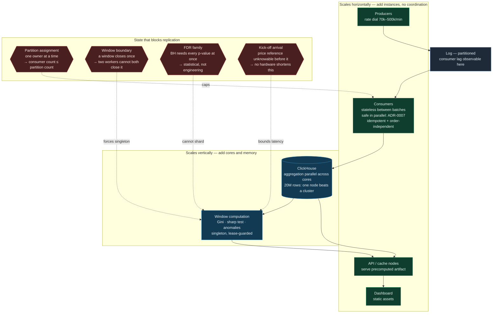

# Scaling topology

What replicates, what only grows, and where the state sits that prevents
replication. Companion to ADR-0010; the breaking points marked here are
**predictions** until the load harness measures them.

## Predicted order of failure

Raise the producer rate and these are expected to saturate in this order.
Recorded before measurement so the harness can refute them.

| # | Saturates | Predicted at | Response |
|---|---|---|---|
| 1 | Consumer CPU (canonicalise + hash, Python) | ~2–4x design point | Add consumers — the live horizontal step |
| 2 | Refresh sweep duration exceeds tick interval | ~5–10x design point | Collapse only recent partitions; `OPTIMIZE FINAL` cold ones; add cores; split Class 1 / Class 2 sweeps |
| 3 | Serving | far beyond | Add API nodes — artifact is computed once per tick regardless of reader count |

## The two regimes, and why the distinction is the whole point

| Symptom | Meaning | Action |
|---|---|---|
| Lag flat, latency rising | Keeping up; freshness degrading within declared bounds | Often none — ADR-0009 declares GGR at 30–60 s |
| Lag growing unbounded | Arrival exceeds capacity | Add consumers now; nothing self-corrects |

Consumer lag is the reason a log sits between producer and consumer at all. At
8,333 events/s the rate does not require one — a direct write path handles it.
The log buys **lag as an observable quantity** and **consumer rescale without
stopping the producer**, and it absorbs ingest during a ClickHouse restart. Those
are operational properties, and the justification should be stated that way
rather than as "it scales".

## Zero downtime

Not a deployment technique — a consequence of decisions already recorded:

- **Rolling consumer replacement** is safe because re-delivery is idempotent
  (ADR-0007). An in-flight batch reprocessed after restart converges to the same
  state.
- **Additive schema change** (`ALTER TABLE ADD COLUMN`, metadata-only) lets
  producer, consumer and reader versions differ mid-rollout. Destructive changes
  go through a new table and a read-path switch.
- **A dead refresh publishes nothing.** Readers keep the last good artifact and
  its watermark, which visibly stops advancing — failure degrades declared
  freshness, not availability.
- **ClickHouse restart** for vertical scaling is the one disruptive step on a
  single node; the log buffers ingest and drains after.
